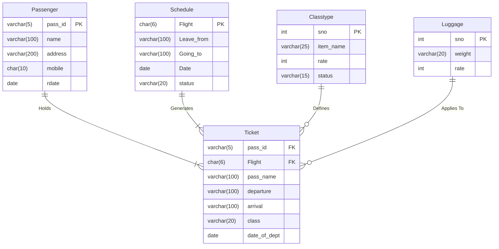

Features
The application is divided into two main panels: a User Panel for passengers and an Admin Panel for system administrators.

User Panel Features
The user-facing application provides an intuitive and robust interface for all passenger-related activities.

Secure Authentication:
    Users can register for a new account and log in securely using their mobile number.
Intelligent Ticket Booking:
    Book a one-way ticket by selecting from available departure and destination cities.
    The system intelligently identifies if a user has a one-way ticket and prompts them to book a corresponding return flight, enforcing a logical travel itinerary.
    Booking is limited to one round trip (one outbound + one return) per user.
    Detailed Flight Selection: Users can view a list of available flights for a chosen route, complete with details like Flight ID, date, and real-time status (e.g., "On Time", "Scheduled").
Seat and Luggage Customization:
    Choose from different seat classes (e.g., First, Business, Economy) with real-time information on vacant seats.
    Select the desired number of seats for a booking.
    Option to add extra luggage with clear pricing.
Itemized Billing: 
    After selecting flights and extras, users can view a detailed, itemized bill that breaks down the cost, including seat rates, luggage fees, and the final total.
Flexible Cancellation Logic:
    Users can cancel a standalone return ticket.
    The system enforces a real-world policy where canceling an outbound ticket automatically cancels the associated return ticket, preventing orphaned bookings.
Real-time Flight Status: 
    Passengers can check the current status of their booked flights at any time.
Boarding Pass Generation: 
    Users can view and "print" a visually formatted boarding pass with all essential travel details, including passenger name, flight info, route, date, class, and seat numbers.

  
Admin Panel Features
The admin panel is a powerful command-line interface for managing the core data of the airline system.

Secure Admin Access: The panel is protected by a password to ensure only authorized personnel can make changes.
Flight Schedule Management:
    Add new flights to the master schedule, defining the flight ID, route, date, and initial status.
    Update details of existing flights, including departure/arrival locations, dates, and status.
Fare and Class Management:
    Add new seating classes to the system (e.g., Premium Economy).
    Update the ticket prices and availability status for each seating class.
Luggage Option Management:
    Add new tiers and weight options for extra luggage.
    Update the pricing for existing luggage options.
User and Ticket Management:
    View a list of all registered passengers in the system.
    Remove a passenger from the database. A robust database trigger ensures that deleting a passenger also automatically deletes all their associated tickets, maintaining data integrity.
    View a comprehensive list of all tickets currently booked in the system.
    Remove specific ticket records as needed.

------------------------------------------------------------------------------------------------------------------------------------------------------------------------------------------------------------------------------------------------------------------------------------------------------------------------------>

BUSINESS LOGIC:-
When you buy a round-trip ticket, you aren't just buying two separate flights; you're buying a single travel contract that includes multiple flight segments. This contract almost always includes a "sequential use" clause.

What it means: This clause states that you must fly the segments of your ticket in the order they are booked. The first flight must be flown first, the second flight second, and so on.

The Consequence: If you are a "no-show" for your first flight (either by missing it or canceling it), the airline's system will automatically cancel all subsequent flights on that same ticket, including your return journey. This is often done without any notification and usually without a refund.

Why Do Airlines Do This?
It primarily comes down to pricing and revenue management. Airlines use complex algorithms to price tickets.

A round-trip ticket from City A to City B is often cheaper than two separate one-way tickets.
Sometimes, a flight from A to C with a layover in B is cheaper than a direct flight from A to B.
To prevent passengers from gaming this system (a practice called "throwaway ticketing" or "hidden-city ticketing"), airlines enforce the sequential use rule. If they didn't, people would buy cheaper round-trip or multi-leg tickets just to use one portion, which would disrupt the airline's pricing structure.

How it is implemented on code:-
confirm_outbound_cancellation(): This method correctly models the most common scenario. By forcing the cancellation of the return ticket when the outbound is canceled, you are enforcing the dependency that exists in a real round-trip ticket.

confirm_single_cancellation(): This method, which allows the user to cancel only the return flight, is also realistic. Once a passenger has flown the outbound leg, they are generally free to cancel or change the return leg (subject to the ticket's fare rules, like change fees).

So, the logic built is not just a technical choice; it accurately simulates a core business rule of the airline industry.
------------------------------------------------------------------------------------------------------------------------------------------------------------------------------------------------------------------------------------------------------------------------------------------------------------------------------>
Triggers used:-
after_passenger_delete:- used to automatically delete passenger ticket info(if any) after the admin deletes a passenger account

------------------------------------------------------------------------------------------------------------------------------------------->
Database schema
## Database Schema

The database is built around a set of core tables that store transactional and descriptive data. The `ticket` table serves as the central hub, connecting passengers to their flights, classes, and luggage details.

### Table Structures

Below are the detailed structures of all the tables implemented in MySQL.

#### `passenger` Table
Stores information about the passengers.

| Field   | Type           | Null | Key | Default    | Extra                |
|---------|----------------|------|-----|------------|----------------------|
| pass_id | `varchar(5)`   | NO   | PRI | NULL       |                      |
| name    | `varchar(100)` | YES  |     | NULL       |                      |
| address | `varchar(200)` | YES  |     | NULL       |                      |
| mobile  | `char(10)`     | YES  |     | NULL       |                      |
| rdate   | `date`         | YES  |     | `curdate()`| DEFAULT_GENERATED    |

#### `schedule` Table
Contains details about all available flights.

| Field      | Type           | Null | Key | Default | Extra |
|------------|----------------|------|-----|---------|-------|
| Flight     | `char(6)`      | YES  |     | NULL    |       |
| Leave_from | `varchar(100)` | YES  |     | NULL    |       |
| Going_to   | `varchar(100)` | YES  |     | NULL    |       |
| Date       | `date`         | YES  |     | NULL    |       |
| status     | `varchar(20)`  | YES  |     | NULL    |       |

#### `classtype` Table
Defines the different travel classes available (e.g., Economy, Business).

| Field     | Type          | Null | Key | Default | Extra |
|-----------|---------------|------|-----|---------|-------|
| sno       | `int`         | NO   | PRI | NULL    |       |
| item_name | `varchar(25)` | YES  |     | NULL    |       |
| rate      | `int`         | YES  |     | NULL    |       |
| status    | `varchar(15)` | YES  |     | NULL    |       |

#### `luggage` Table
Defines different luggage options and their corresponding rates.

| Field  | Type          | Null | Key | Default | Extra |
|--------|---------------|------|-----|---------|-------|
| sno    | `int`         | NO   | PRI | NULL    |       |
| weight | `varchar(20)` | YES  |     | NULL    |       |
| rate   | `int`         | YES  |     | NULL    |       |

#### `ticket` Table
The central transactional table that records a booking.

| Field         | Type           | Null | Key | Default | Extra |
|---------------|----------------|------|-----|---------|-------|
| pass_id       | `varchar(5)`   | NO   |     | NULL    |       |
| pass_name     | `varchar(100)` | YES  |     | NULL    |       |
| Flight        | `char(6)`      | YES  |     | NULL    |       |
| departure     | `varchar(100)` | YES  |     | NULL    |       |
| arrival       | `varchar(100)` | YES  |     | NULL    |       |
| class         | `varchar(20)`  | YES  |     | NULL    |       |
| date_of_dept  | `date`         | YES  |     | NULL    |       |
| extra_luggage | `varchar(5)`   | YES  |     | NULL    |       |
| luggage_rate  | `int`          | YES  |     | NULL    |       |
| seat_rate     | `int`          | YES  |     | NULL    |       |
| total_rate    | `int`          | YES  |     | NULL    |       |
| seats         | `varchar(100)` | YES  |     | NULL    |       |

### Entity-Relationship (ER) Diagram

The following diagram visualizes the relationships between the tables based on the complete schema.

### Schema Notes & Observations
* **Automatic Registration Date**: The `passenger.rdate` column is configured to automatically use the current date (`curdate()`) as its default value, which is a useful feature for tracking when a passenger record was created.

## How to Use

1.  Create a new database in your MySQL server (e.g., `CREATE DATABASE adms;`).
2.  Use the new database (`USE adms;`).
3.  Execute the `.sql` file containing the `CREATE TABLE` statements to build the schema.

## Technologies Used
* **Database**: MySQL

